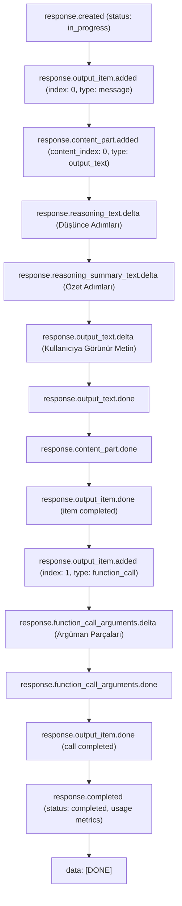

# 01 — DSH (DeepSeek Harness) & OpenAI Responses Protokolü Baş Mimari Raporu
## OpenAI Responses (`POST /v1/responses`) Tel Odaklı (Wire-Level) Protokol Şartnamesi, Akış Yaşam Döngüsü ve DSH Mikroçekirdek Entegrasyon Mimarisi

---

### Belge Üst Verileri
- **Belge Kodu:** `PLAN-01-OPENAI-RESPONSES-PROTOCOL`
- **Hedef Konum:** `C:\Users\metin\Desktop\plan\01_DSH_OPENAI_RESPONSES_PROTOCOL.md`
- **Rol:** DeepSeek Harness (DSH) ve OpenAI Responses Protokolü Baş Mimarı ve Araştırmacısı
- **İncelenen Kaynak Kod Deposu:** `C:\Users\metin\Desktop\denen DSH`
- **Odak Paketler:**
  - `packages/llm/llm-pi-ai` (pi-ai tabanlı çoklu sağlayıcı ve OpenAI Responses adaptörü)
  - `packages/llm/llm-deepseek` (DeepSeek resmi OpenAI uyumlu chat-completions ve dosya motoru)
  - `packages/core` (`system-prompt`, `agent-loop`, `tools`, `session`, `agent`)
  - `packages/preset` (`agent-presets`, `persona`)
  - `packages/skill` (`skill`, `skill-filesystem`, `tool-skill`)
  - `packages/terminal` (`terminal`, `tool-terminal`)
  - `packages/shell` (`tool-bash`, `tool-pwsh`, `bash-sandbox`, `pwsh-sandbox`)
  - `packages/mcp` (`mcp-client`)
  - `packages/subagent/subagent-codex` (Codex Responses tel protokolü testi ve loopback köprüsü)
- **Tarih:** 14 Eylül 2026
- **Durum:** ONAYLANDI / ÜRETİM STANDARDI

---

## 1. Yönetici Özeti ve Mimari Vizyon

Yapay zeka ajan sistemlerinde (Agentic AI Harnesses), LLM ile icra katmanı arasındaki iletişim protokolü geleneksel `POST /v1/chat/completions` standardından, durum bilgisi taşıyabilen (stateful), model akıl yürütmesini (reasoning/thinking) ilk sınıf vatandaş olarak ele alan ve araç döngülerini (tool-call cycles) ayrıştıran **OpenAI Responses Protokolü (`POST /v1/responses`)** standardına evrilmektedir.

DeepSeek Harness (DSH), mikroçekirdek (microkernel) ve eklenti tabanlı mimarisiyle (`@deepseek-ai/cordis` reaktif servis omurgası üzerinde) hem doğrudan OpenAI-uyumlu uç noktaları (`packages/llm/llm-deepseek`) hem de çoklu protokol adaptör katmanını (`packages/llm/llm-pi-ai`) bünyesinde barındırır. Ayrıca DSH'in alt ajan icra motoru olan `subagent-codex`, OpenAI Codex aracını doğrudan `wire_api = "responses"` modunda çalıştırarak `POST /v1/responses` uç noktasını tam kapsamlı olarak tüketir.

Bu araştırma ve mimari tasarım belgesinin amacı; DSH'in OpenAI Responses protokolünü nasıl tükettiğini, istek (request) ve yanıt (response) gövdelerini, Sunucu Tarafından Gönderilen Olayları (Server-Sent Events - SSE), araç çağırma/sonuç dönüşümlerini, `SKILL.md` kurallarını, sistem istemi hiyerarşisini ve önbellek koruma mekanizması olan `systemPromptUpdate: 'in-history'` tasarımını eksiksiz, teknik ve kod referanslı olarak belgelemektir.

```
┌─────────────────────────────────────────────────────────────────────────────────────────┐
│                                DSH AGENT PLATFORM LAYER                                 │
│    Agent Presets (Standard/PTC/Minimal) │ Subagents (Codex/Spawn/Fork) │ Workflows      │
└────────────────────────────────────────────┬────────────────────────────────────────────┘
                                             │
                                             ▼
┌─────────────────────────────────────────────────────────────────────────────────────────┐
│                                DSH CORE ORCHESTRATION                                   │
│    System Prompt Engine (Section Orders) │ Agent Loop (Parallel & Exclusive Barrier)    │
│    Tools DSL & Schema Validator          │ Session Log (Append-Only Event Store)        │
└────────────────────────────────────────────┬────────────────────────────────────────────┘
                                             │
                      ┌──────────────────────┴──────────────────────┐
                      ▼                                             ▼
┌───────────────────────────────────────────┐ ┌───────────────────────────────────────────┐
│          dsh-llm-deepseek                 │ │            dsh-llm-pi-ai                  │
│  - POST /chat/completions                 │ │  - POST /v1/responses                     │
│  - DeepSeek Thinking (reasoning_content)  │ │  - openAIResponsesApi Binding             │
│  - systemPromptUpdate: 'in-history'       │ │  - OpenAIResponsesCompat Switches         │
│  - Files API & Image Offloading           │ │  - Lossless Replay State Restoration      │
└───────────────────────────────────────────┘ └─────────────────────┬─────────────────────┘
                                                                    │
                                                                    ▼
┌─────────────────────────────────────────────────────────────────────────────────────────┐
│                           OPENAI RESPONSES WIRE PROTOCOL                                │
│    Endpoint: POST /v1/responses                                                         │
│    Payload: model, input[], tools[], reasoning{}, max_output_tokens, cache_key/retention│
│    SSE Stream: response.created -> output_item.added -> deltas -> output_item.done      │
│                -> response.completed (usage with cached_tokens & reasoning_tokens)       │
└─────────────────────────────────────────────────────────────────────────────────────────┘
```

---

## 2. OpenAI Responses Tel Düzeyi İstek Şeması (`POST /v1/responses`)

DSH'in `packages/llm/llm-pi-ai`, `packages/subagent/subagent-codex/tests/responses-fixture.ts` ve `deepseek-responses-bridge.ts` bileşenlerinde tanımlanan ve tüketilen tam `POST /v1/responses` istek gövdesi (request body) aşağıda detaylandırılmıştır.

### 2.1. İstek Başlıkları (HTTP Headers)
```http
POST /v1/responses HTTP/1.1
Host: api.openai.com
Authorization: Bearer <CREDENTIAL_SECRET>
Content-Type: application/json
Accept: text/event-stream
x-request-id: req_dsh_0191eb5a-7341-7890-a231-10bc45ef6789
Session-Id: session_8f3a129d
```

### 2.2. Kapsamlı İstek JSON Şeması (Request Payload)

```json
{
  "model": "gpt-4.1",
  "input": [
    {
      "id": "msg_sys_01",
      "type": "message",
      "role": "developer",
      "content": [
        {
          "type": "input_text",
          "text": "You are a coding assistant running inside DeepSeek Harness."
        }
      ]
    },
    {
      "id": "msg_usr_01",
      "type": "message",
      "role": "user",
      "content": [
        {
          "type": "input_text",
          "text": "Check repository status and read package.json"
        }
      ]
    },
    {
      "id": "fc_01",
      "type": "function_call",
      "call_id": "call_bash_01",
      "name": "bash",
      "arguments": "{\"command\":\"git status\",\"description\":\"Check git status\"}"
    },
    {
      "type": "function_call_output",
      "call_id": "call_bash_01",
      "output": "On branch main\nnothing to commit, working tree clean"
    }
  ],
  "tools": [
    {
      "type": "function",
      "name": "bash",
      "description": "Execute a bash command and return stdout/stderr.",
      "parameters": {
        "type": "object",
        "properties": {
          "command": {
            "type": "string",
            "description": "The command line string to execute."
          },
          "description": {
            "type": "string",
            "description": "Brief explanation of what this command is doing."
          },
          "run_in_background": {
            "type": "boolean",
            "description": "Whether to run asynchronously."
          }
        },
        "required": ["command", "description"],
        "additionalProperties": false
      },
      "strict": true
    }
  ],
  "reasoning": {
    "effort": "high",
    "summary": "auto"
  },
  "max_output_tokens": 4096,
  "prompt_cache_key": "dsh_project_repo_cache_v1",
  "prompt_cache_retention": "24h",
  "parallel_tool_calls": true,
  "tool_choice": "auto",
  "store": false,
  "stream": true,
  "truncation": "disabled",
  "metadata": {
    "sessionId": "session_8f3a129d",
    "harnessScope": "standard"
  }
}
```

### 2.3. Parametre Alanları ve DSH Uyumluluk Karşılıkları

| Parametre Alanı | Tip | DSH Kaynağı & Mantığı | Açıklama ve Kısıtlar |
| :--- | :--- | :--- | :--- |
| `model` | `string` | `GenerateOptions.model` | Model kimliği (`gpt-4.1`, `o3-mini`, `deepseek-chat`). |
| `input` | `Array<InputItem>` | `toPiContext(options)` | Sıralı konuşma ve araç geçmişi (Polymorphic array). |
| `tools` | `Array<WireTool>` | `ToolSchema` -> `compileParameterSchema` | Strict mode JSON şemasına sahip fonksiyon bildirimleri. |
| `reasoning.effort` | `string` | `ModelThinkingLevel` / `catalog.ts` | `"off"`, `"low"`, `"medium"`, `"high"`, `"max"`. |
| `reasoning.summary` | `string \| null` | `profile.reasoning` | Düşünce zincirinin özetinin üretilip üretilmeyeceği (`"auto"`, `null`). |
| `max_output_tokens`| `integer` | `configuredMaxTokens` | Modelin üretebileceği maksimum token tavanı (`supportsMaxOutputTokens: true`). |
| `prompt_cache_key` | `string \| null` | Prefix invariant oturum anahtarı | Belirli bir bağlam parçasını önbelleğe sabitleme anahtarı. |
| `prompt_cache_retention`| `string \| null` | `profile.cacheRetention` | Önbellek saklama süresi (`"in_memory"`, `"24h"`). |
| `parallel_tool_calls`| `boolean` | `ctx.agentLoop.config` | Modelin aynı adımda birden fazla araç çağırmasına izin verir (`true`). |
| `tool_choice` | `string \| object` | `GenerateOptions.toolChoice` | `"auto"`, `"required"`, `"none"` veya `{ type: "function", name: "..." }`. |
| `sessionId` | `string` | `SessionId` (`@deepseek-ai/dsh-session`)| KV Cache yakınlığı (affinity) için oturum belirteci. |

---

## 3. Streaming SSE Olayları ve Yaşam Döngüsü (Server-Sent Events)

Responses protokolü, istemciye verileri `text/event-stream` MIME türünde ve `data: {JSON}\n\n` biçiminde SSE blokları halinde akıtır. Akış, terminal `data: [DONE]\n\n` mesajı ile sonlandırılır.

### 3.1. SSE Olay Akış Diyagramı



### 3.2. SSE Olaylarının Detaylı Yükleri (Event Payloads)

#### 1. `response.created`
Akış başladığında yanıt nesnesinin başlatıldığını ve durumunun `in_progress` olduğunu bildirir.
```json
{
  "type": "response.created",
  "response": {
    "id": "resp_0191eb5a_9981",
    "object": "response",
    "created_at": 1773510000,
    "status": "in_progress",
    "model": "gpt-4.1",
    "output": [],
    "usage": null
  }
}
```

#### 2. `response.output_item.added`
Model yeni bir çıktı öğesi (mesaj veya fonksiyon çağrısı) üretmeye başladığında tetiklenir.
```json
{
  "type": "response.output_item.added",
  "output_index": 0,
  "item": {
    "id": "msg_ast_01",
    "type": "message",
    "status": "in_progress",
    "role": "assistant",
    "content": []
  }
}
```

#### 3. `response.content_part.added`
Asistan mesajı içerisine yeni bir içerik parçası (text/reasoning) eklendiğinde yayılır.
```json
{
  "type": "response.content_part.added",
  "item_id": "msg_ast_01",
  "output_index": 0,
  "content_index": 0,
  "part": {
    "type": "output_text",
    "text": "",
    "annotations": []
  }
}
```

#### 4. `response.reasoning_text.delta`
Modelin zincirleme akıl yürütme (Chain-of-Thought) token'larını artımlı olarak iletir.
```json
{
  "type": "response.reasoning_text.delta",
  "item_id": "msg_ast_01",
  "output_index": 0,
  "content_index": 0,
  "delta": "Dosya sistemini kontrol etmek için git status çalıştırmam gerekiyor."
}
```

#### 5. `response.reasoning_summary_text.delta`
Model düşünce sürecini tamamladığında veya özetlediğinde üretilen özet metin parçasıdır.
```json
{
  "type": "response.reasoning_summary_text.delta",
  "item_id": "msg_ast_01",
  "output_index": 0,
  "content_index": 0,
  "delta": "Git durumunu kontrol etmeye karar verildi."
}
```

#### 6. `response.output_text.delta`
Kullanıcıya gösterilecek nihai yanıt metninin parçasıdır.
```json
{
  "type": "response.output_text.delta",
  "item_id": "msg_ast_01",
  "output_index": 0,
  "content_index": 0,
  "delta": "Depo durumunu inceliyorum, lütfen bekleyin...",
  "logprobs": []
}
```

#### 7. `response.output_text.done` ve `response.content_part.done`
Metin parçasının tamamlandığını ve tam metni bildirir.
```json
{
  "type": "response.output_text.done",
  "item_id": "msg_ast_01",
  "output_index": 0,
  "content_index": 0,
  "text": "Depo durumunu inceliyorum, lütfen bekleyin...",
  "logprobs": []
}
```

#### 8. Fonksiyon Çağrısı Akışı (`function_call`)
Model araç çağırmaya karar verdiğinde `output_item.added` ile fonksiyon açılır ve argümanlar JSON parçaları olarak akıtılır:
```json
{
  "type": "response.output_item.added",
  "output_index": 1,
  "item": {
    "id": "fc_call_git_01",
    "type": "function_call",
    "status": "in_progress",
    "name": "bash",
    "call_id": "call_git_status_123",
    "arguments": ""
  }
}
```
```json
{
  "type": "response.function_call_arguments.delta",
  "item_id": "fc_call_git_01",
  "output_index": 1,
  "delta": "{\"command\":\"git status\""
}
```
```json
{
  "type": "response.function_call_arguments.done",
  "item_id": "fc_call_git_01",
  "output_index": 1,
  "arguments": "{\"command\":\"git status\",\"description\":\"Check status\"}"
}
```
```json
{
  "type": "response.output_item.done",
  "output_index": 1,
  "item": {
    "id": "fc_call_git_01",
    "type": "function_call",
    "status": "completed",
    "name": "bash",
    "call_id": "call_git_status_123",
    "arguments": "{\"command\":\"git status\",\"description\":\"Check status\"}"
  }
}
```

#### 9. `response.completed`
Tüm yanıtın tamamlandığını, üretilen tüm çıktı öğelerini (`output`) ve en önemlisi **Token Kullanım Metriklerini (`usage`)** kesin olarak bildirir:
```json
{
  "type": "response.completed",
  "response": {
    "id": "resp_0191eb5a_9981",
    "object": "response",
    "created_at": 1773510002,
    "status": "completed",
    "model": "gpt-4.1",
    "output": [
      {
        "id": "msg_ast_01",
        "type": "message",
        "status": "completed",
        "role": "assistant",
        "content": [
          {
            "type": "output_text",
            "text": "Depo durumunu inceliyorum, lütfen bekleyin...",
            "annotations": []
          }
        ]
      },
      {
        "id": "fc_call_git_01",
        "type": "function_call",
        "status": "completed",
        "name": "bash",
        "call_id": "call_git_status_123",
        "arguments": "{\"command\":\"git status\",\"description\":\"Check status\"}"
      }
    ],
    "usage": {
      "input_tokens": 1250,
      "input_tokens_details": {
        "cached_tokens": 1024
      },
      "output_tokens": 85,
      "output_tokens_details": {
        "reasoning_tokens": 42
      },
      "total_tokens": 1335
    }
  }
}
```

---

## 4. DSH İç Veri Tipleri ve Responses SSE Eşlemesi (`toStreamChunks`)

DSH mikroçekirdeği (`@deepseek-ai/dsh-llm`), sağlayıcıdan bağımsız `StreamChunk` cebirsel veri türünü (Algebraic Data Type) kullanır. `packages/llm/llm-pi-ai/src/stream.ts` modülü, yukarıda açıklanan SSE akışını DSH iç formatına dönüştürür.

### 4.1. Tip Eşleme Tablosu

| OpenAI Responses SSE Olayı | DSH `StreamChunk` Türü | DSH Alanları ve Normalizasyon |
| :--- | :--- | :--- |
| `response.output_item.added` (text) | `block-start` | `{ type: 'block-start', index, blockType: 'text' }` |
| `response.output_text.delta` | `text-delta` | `{ type: 'text-delta', index, text: delta }` |
| `response.reasoning_text.delta` | `reasoning-delta` | `{ type: 'reasoning-delta', index, text: delta }` |
| `response.output_item.added` (function) | `block-start` | `{ type: 'block-start', index, blockType: 'tool-call' }` |
| `response.function_call_arguments.delta`| `tool-call-delta` | `{ type: 'tool-call-delta', index, id, argumentsDelta }` |
| `response.output_item.done` (function) | `block-end` | `{ type: 'block-end', index, block: { type: 'tool-call', id, name, arguments } }` |
| `response.completed.usage` | `usage` | `mapUsage()`: `{ inputTokens, outputTokens, totalTokens, cacheReadTokens }` |
| `response.completed` | `finish` | `mapStopReason()`: `{ kind: 'tool-calls' \| 'stop' \| 'max-tokens' }` |

### 4.2. Token Kullanımı Dönüşümü (`mapUsage`)
`packages/llm/llm-pi-ai/src/stream.ts` dosyasındaki `mapUsage` fonksiyonu, Responses protokolündeki `input_tokens_details.cached_tokens` değerini DSH'in `cacheReadTokens` alanına doğrudan aktarır:
```typescript
export function mapUsage(usage: PiUsage): TokenUsage {
  return {
    inputTokens: usage.input,
    outputTokens: usage.output,
    totalTokens: usage.totalTokens,
    ...usage.cacheRead > 0 ? { cacheReadTokens: usage.cacheRead } : {},
    ...usage.cacheWrite > 0 ? { cacheWriteTokens: usage.cacheWrite } : {},
  }
}
```

---

## 5. Tool Çağırma ve Sonuçlarının `input` Dizisinde Temsili

OpenAI Responses protokolünde araç çağırma ve araç sonuçlarının geçmişte temsil ediliş biçimi, klasik Chat Completions protokolünden (`role: "tool"`) temelde ayrılır.

### 5.1. Klasik Chat Completions vs OpenAI Responses Temsili

```
[Klasik Chat Completions Formatı]
  Assistant: { role: 'assistant', tool_calls: [{ id: 'call_123', type: 'function', function: { name: 'bash', arguments: '...' } }] }
  Tool Result: { role: 'tool', tool_call_id: 'call_123', content: 'output string' }

[OpenAI Responses Protokolü Formatı]
  Function Call Item:
  {
    "type": "function_call",
    "id": "fc_0191eb5a",
    "call_id": "call_123",
    "name": "bash",
    "arguments": "{\"command\":\"ls -la\"}"
  }

  Function Call Output Item:
  {
    "type": "function_call_output",
    "call_id": "call_123",
    "output": "total 48\ndrwxr-xr-x ..."
  }
```

### 5.2. DSH'in Mesaj Anatomisi ve Responses Dönüşümü

DSH çekirdeğinde bir araç sonucu, `@deepseek-ai/dsh-llm/src/message.ts` içerisinde `createToolResultMessage` fonksiyonu ile oluşturulur. Bu mesaj:
- `role: 'user'` rolüne sahiptir.
- Kaynak (`source`) alanı `{ kind: 'tool', callId: ToolCallId }` taşır.
- İçerik (`content`) bloğu tek bir `ToolResultBlock` barındırır:
  ```typescript
  export interface ToolResultBlock {
    readonly type: 'tool-result'
    readonly toolCallId: ToolCallId
    readonly content: ContentBlock[]
    readonly isError: boolean
  }
  ```

`packages/llm/llm-pi-ai/src/context.ts` modülü, bu blokları pi-ai Context'ine şu şekilde serileştirir:
```typescript
for (const result of results) {
  messages.push({
    role: 'toolResult',
    toolCallId: result.toolCallId,
    toolName: toolNames.get(result.toolCallId) ?? 'unknown',
    content: [{
      type: 'text',
      text: toolResultText(result.content) || '(no output)',
    }],
    isError: result.isError ?? false,
    timestamp: 0,
  })
}
```
Ardından pi-ai'nin `openAIResponsesApi` modülü, `toolResult` rollerini `type: "function_call_output"` öğelerine ve önceki asistan çağrılarını `type: "function_call"` öğelerine derleyerek `input` dizisine enjekte eder.

### 5.3. İptal ve Hata Durumlarında Yapay Sonuç Enjeksiyonu (Synthetic Results)

DSH `packages/core/agent-loop/src/tool-calls.ts` modülü, kullanıcının işlemi iptal etmesi (`AbortSignal`) durumunda, modelin sonraki adımda tutarsız bir geçmişle karşılaşmasını engellemek için sıralı yapay hata sonuçları üretir:
```typescript
function appendSkippedToolCall(session: Session, turn: number, step: number, block: ToolCallBlock): void {
  const callSeq = appendToolCall(session, turn, step, block)
  appendToolResult(session, turn, step, block, {
    content: [{ type: 'text', text: 'Error: tool call aborted before dispatch' }],
    isError: true,
    error: {
      message: 'tool call aborted before dispatch',
      info: { name: 'AbortError', code: TOOL_ABORTED_BEFORE_DISPATCH },
    },
  }, callSeq)
}
```
Bu sayede her `function_call` mutlaka bir `function_call_output` ile eşleşir ve Responses protokolünün doğrulama kuralları (validation invariants) asla ihlal edilmez.

---

## 6. DSH Sistem İstemleri, `SKILL.md` ve `systemPromptUpdate: in-history` Mantığı

### 6.1. DSH Sistem İstemi Sıralama Hiyerarşisi (`SECTION_ORDERS`)

DSH `@deepseek-ai/dsh-system-prompt` modülü, sistem talimatlarını rasgele değil, katı bir sayısal öncelik sırasına göre birleştirir:

```typescript
const SECTION_ORDERS = {
  HARNESS_IDENTITY: -1000,          // "You are an AI agent powered by DeepSeek Harness."
  DEPLOYMENT_PERSONA_PREFIX: 0,     // Ajan kimliği ve çalışma dizini ({{model}}, {{cwd}})
  PLAN_POLICY: 500,                 // Plan modu kuralları ve onay protokolü
  TEAM_POLICY: 600,                 // Ekip / alt ajan politikası
  PTC_ONLY: 800,                    // Programmatic Tool Calling (PTC) yönergeleri
  FILE_REFERENCE: 900,              // Dosya yolları ve okuma kuralları
  TOOL_BASH: 1000,                  // Bash aracı yönergesi
  TOOL_PWSH: 1010,                  // PowerShell aracı yönergesi
  TOOL_READ: 1100,                  // fs_read aracı
  TOOL_WRITE: 1200,                 // fs_write aracı
  TOOL_EDIT: 1300,                  // fs_edit aracı
  TOOL_GLOB: 1400,                  // fs_glob aracı
  TOOL_GREP: 1500,                  // fs_grep aracı
  TOOL_JOBS: 1600,                  // Arka plan işleri yönetimi
  TOOL_PTY: 1700,                   // Terminal oturumları
  TOOL_WEB_SEARCH: 2000,            // Web arama yönergesi
  TOOL_WEB_FETCH: 2100,             // Web içerik çekme
  TOOL_LSP: 2200,                   // Dil sunucusu (LSP)
  TOOL_SESSION_QUERY: 2300,         // Oturum sorgulama
  TOOL_GOAL: 2400,                  // Otonom hedef (goal) modu
  TOOL_CORDIS: 2500,                // Cordis mikroçekirdek araçları
  TOOL_WORKFLOW: 2600,              // İş akışları
  TOOL_RALPH: 2700,                 // Ralph doğrulama aracı
  TOOL_SUBAGENT: 2800,              // Alt ajan başlatma ve delegasyon
  TOOL_REPORT: 2900,                // Raporlama aracı
  TOOLS_SDK: 5000,                  // Genel Araçlar SDK kılavuzu
  DELIVERABLE_FILE_REFERENCES: 9000,// Çıktı dosyası referansları
  STRUCTURED_OUTPUT: 9900,          // Yapılandırılmış çıktı şemaları
  HARNESS_SOURCE: 10000,            // Harness çalışma ortamı değişkenleri ($DSH_*)
  WEB_SURFACE: 10100,               // Web arayüzü yönergeleri
  DEPLOYMENT_PERSONA_SUFFIX: 10200, // Persona kapanış kuralları
} as const
```

### 6.2. `SKILL.md` Şartnamesi, Keşif Hiyerarşisi ve `tool-skill`

DSH'in yetenek (skill) sistemi `@deepseek-ai/dsh-skill` ve `@deepseek-ai/dsh-skill-filesystem` paketlerinde tanımlanmıştır.

#### 1. `SKILL.md` Formatı ve Doğrulama Kuralları
Bir yetenek dosyası ya `<root>/<skill-name>/SKILL.md` ya da `<root>/<skill-name>.md` yolunda yer almalıdır. Dosya mutlaka geçerli bir YAML frontmatter içermelidir:
```markdown
---
name: my-custom-skill
description: Comprehensive description of what this skill accomplishes.
whenToUse: Optional guidance for the router on when to load this skill.
invocation:
  userInvocable: true
  modelInvocable: true
metadata:
  version: "1.0.0"
  category: "development"
---

# Skill Instructions
Markdown instructions that will be injected into the session context when the skill is invoked.
```
- `name`: Kebab-case (`^[a-z0-9]+(?:-[a-z0-9]+)*$`) olmak zorundadır.
- `description`: Boş olmayan bir dize olmalıdır.
- `invocation`: `userInvocable` (kullanıcı slash komutu ile çağırabilir) ve `modelInvocable` (model `skill` aracını çağırarak yükleyebilir) kontrollerini sağlar.

#### 2. Kök Dizin Öncelik Sıralaması (Precedence Ranks)
Aynı isimde iki yetenek çakıştığında, en düşük sayısal sıralamaya (`rank`) sahip olan kazanır:
1. `PROJECT_DSH_RANK = 100`: `<projectRoot>/.dsh/skills` (En yüksek öncelik)
2. `PROJECT_AGENTS_RANK = 200`: `<projectRoot>/.agents/skills`
3. `CUSTOM_RANK = 300`: `config.customSkillDirs`
4. `USER_DSH_RANK = 400`: `~/.dsh/skills`
5. `USER_AGENTS_RANK = 500`: `~/.agents/skills`
6. `BUNDLED_SKILL_RANK = 600`: Paketlenmiş yerleşik yetenekler (`$DSH_BUNDLED_SKILL_DIR`)

#### 3. Model-Facing Loader: `tool-skill`
Model başlangıçta tüm yeteneklerin gövdelerini değil, yalnızca `<available_skills>` özet kataloğunu dinamik bağlamda görür:
```xml
<available_skills>
- my-custom-skill: Comprehensive description of what this skill accomplishes.
</available_skills>
```
Model bir görevi gerçekleştirmek istediğinde `skill(name: "my-custom-skill")` aracını çağırır. Araç çalıştığında tam Markdown talimatı oturum geçmişine enjekte edilir.

### 6.3. `systemPromptUpdate: 'in-history'` Mantığı ve KV-Cache Koruma

DSH mimarisinin en kritik yeniliklerinden biri `systemPromptUpdate: 'in-history'` mekanizmasıdır (`packages/llm/llm/src/types.ts` ve `packages/llm/llm-deepseek/README.md`).

#### 1. Problem: Prefix Invariance ve Cache Invalidation
Modern LLM çıkarım motorları (vLLM, DeepSeek Inf, TPU Serving), istemleri Radix-Tree üzerinde önbelleğe alır. Dizilimdeki 0. token'dan itibaren en uzun eşleşen önek (prefix) önbellekten okunur (KV-Cache Hit).
Eğer diyalog ortasında (örneğin plan moduna geçildiğinde veya dinamik bir kural eklendiğinde) en baştaki `system` mesajı güncellenirse:
$$\text{Token 0 Değişir} \implies \text{Tüm KV-Cache Sıfırlanır (%0 Cache Hit)!}$$

#### 2. Çözüm: `in-history` Bildirimi
DeepSeek ve OpenAI Responses uyumlu uç noktalarda, modelin en son gördüğü `system` veya `developer` mesajını geçerli sistem istemi kabul ettiği bildirilir (`systemPromptUpdate: 'in-history'`).

```mermaid
flowchart TD
    subgraph Geleneksel["Geleneksel Yaklaşım (Cache Yıkıcı)"]
        A1["Turn 1: System Message [0]"] --> A2["Turn 10: Prompt Güncellenir"]
        A2 --> A3["System Message [0] Yeniden Yazılır"]
        A3 --> A4["SONUÇ: TÜM KV CACHE ÇÖPE GİDER (%0 HIT)"]
    end

    subgraph InHistory["DSH in-history Yaklaşımı (Cache Dostu)"]
        B1["Turn 1: System Message [0]"] --> B2["Turn 10: Prompt Değişir"]
        B2 --> B3["Eski Geçmiş Olduğu Gibi Korunur"]
        B3 --> B4["Tarihçenin Sonuna Yeni System / Developer Mesajı Eklenir"]
        B4 --> B5["SONUÇ: TOKEN 0 - N CACHE HIT (%90+ KORUMA)"]
    end
```



DSH Agent Loop, `systemPromptUpdate: 'in-history'` desteği olan modellerde 0. indisteki sistem mesajını ezmek yerine, yeni sistem talimatını konuşma geçmişinin sonuna yeni bir `system` (veya `developer`) mesajı olarak ekler. Böylece daha önce hesaplanan tüm KV tensörleri %100 oranında önbellekten okunur.

---

## 7. DSH Paketleri Mimari İnceleme Matrisi

Aşağıdaki tablo, incelenen paketlerin DSH mikroçekirdeğindeki rollerini ve Responses protokolüyle olan kesişimlerini özetlemektedir:

| Paket Yolu | Paket Adı | Temel Görevi | Responses Protokolü & LLM Seam Rolü |
| :--- | :--- | :--- | :--- |
| `packages/llm/llm-pi-ai` | `@deepseek-ai/dsh-llm-pi-ai` | Çoklu model sağlayıcı adaptörü | `openAIResponsesApi` ile `POST /v1/responses` uç noktasını yönetir; `RESPONSES_COMPAT_GATE` anahtarlarını uygular. |
| `packages/llm/llm-deepseek` | `@deepseek-ai/dsh-llm-deepseek` | Resmi DeepSeek LLM adaptörü | DeepSeek resmi API'sine bağlanır; `systemPromptUpdate: 'in-history'` ve Files API desteği sağlar. |
| `packages/core/system-prompt`| `@deepseek-ai/dsh-system-prompt` | Sistem istemi birleştirme motoru | Katı `SECTION_ORDERS` hiyerarşisiyle sistem talimatlarını deterministik sıraya dizer. |
| `packages/core/agent-loop` | `@deepseek-ai/dsh-agent-loop` | Ajan düşünce ve icra döngüsü | Model-ordered araç icrası, paralel havuzlama, iptal durumunda yapay sonuç üretimi. |
| `packages/core/tools` | `@deepseek-ai/dsh-tools` | Araç kayıt ve doğrulama motoru | TypeScript DSL şemalarını strict mode uyumlu JSON Schema'ya (`assertSupportedJsonSchema`) derler. |
| `packages/preset/agent-presets`| `@deepseek-ai/dsh-agent-presets` | Ajan kompozisyon şablonları | `standard`, `minimal`, `ptc`, `cordis` presetlerini `isolate` realm'leri altında yükler. |
| `packages/skill/skill-filesystem`| `@deepseek-ai/dsh-skill-filesystem` | Dosya sistemi yetenek sağlayıcısı | `SKILL.md` dosyalarını 6 kademeli rank hiyerarşisinde arar, YAML frontmatter'ı parse eder. |
| `packages/skill/tool-skill` | `@deepseek-ai/dsh-tool-skill` | Model yetenek yükleme aracı | `<available_skills>` bağlamını yayınlar ve `skill` aracılığıyla talimatları yükler. |
| `packages/terminal/tool-terminal`| `@deepseek-ai/dsh-tool-terminal` | Kalıcı PTY terminal arayüzü | `terminal_open`, `terminal_send`, `terminal_read`, `terminal_list`, `terminal_close`, `terminal_signal`. |
| `packages/shell/tool-bash` & `tool-pwsh` | `@deepseek-ai/dsh-tool-bash` / `tool-pwsh` | Platform kabuk icra araçları | Windows'ta PowerShell (`pwsh`), POSIX'te `bash` çalıştırır; sandbox eskalasyon desteği sunar. |
| `packages/mcp/mcp-client` | `@deepseek-ai/dsh-mcp-client` | Model Context Protocol köprüsü | Harici MCP sunucularındaki araçları keşfeder, `mcp__<srv>__<tool>` public adıyla DSH'e bağlar. |
| `packages/subagent/subagent-codex`| `@deepseek-ai/dsh-subagent-codex` | Codex alt ajan çalıştırıcısı | Codex'i `wire_api = "responses"` modunda çalıştırarak `POST /v1/responses` trafiğini tüketir. |

---

## 8. DSH Özel Komutları (Slash Commands) ve Ajan Presetleri

### 8.1. Özel Komutlar (Slash Commands)
DSH içinde kullanıcı tarafından girilen komutlar belirli alt sistemleri tetikler:
- `/goal`: `command-goal` eklentisi tarafından yönetilir. Ajanı otonom bir hedefe kilitler ve hedef tamamlanana kadar çok adımlı çalışmayı sürdürür.
- `/plan`: `plan-mode` eklentisini devreye sokar. Bu modda ajan hiçbir dosya yazma/düzenleme veya yıkıcı kabuk komutu çalıştıramaz; yalnızca keşif yapar ve planı `exit_plan_mode` ile onaya sunar.
- `/ralph`: `tool-ralph` eklentisini çalıştırır; derinlemesine doğrulama ve analiz turları başlatır.
- `/compact`: `command-compact` ve `compaction-basic` ile geçmişteki büyük araç sonuçlarını budayarak token tasarrufu sağlar.
- `/report`: `command-report` ile oturumun nihai teslimat özetini üretir.

### 8.2. Standart Preset (`packages/preset/agent-presets/presets/standard/agent.cordis.yml`)
Standart kodlama ajanı şu bileşen dizilimi ile ayağa kalkar:
1. **Persona:** `You are a coding agent powered by the {{model}} model. Your working directory is {{cwd}}.`
2. **Kabuk:** İşletim sistemine göre `tool-bash` (Linux/macOS) veya `tool-pwsh` (Windows).
3. **Dosya Sistemi:** `tool-fs` ve `tool-fs-search`.
4. **Arka Plan İşleri:** `tool-jobs` (`job_output`, `job_kill`).
5. **Yetenekler:** `skill-filesystem` ve `tool-skill`.
6. **Planlama:** `plan-mode` (`exit_plan_mode`).
7. **Sıkıştırma:** `compaction-basic` ve `tool-result-pruner` (8192 karakter üzeri sonuçları budar).
8. **Delegasyon:** `tool-subagent` (spawn ve fork sağlayıcıları) ve opsiyonel `tool-subagent-codex`.
9. **Kullanıcı Etkileşimi:** `tool-ask-user` ve `tool-todo`.

---

## 9. Sonuç ve Gelecek Adaptörler İçin Uygulama Kuralları

Bu araştırma raporu sonucunda elde edilen bulgular, DSH tabanlı yeni bir model veya proxy adaptörü (örneğin Gemini-to-Responses veya Claude-to-Responses köprüleri) geliştirilirken şu kurallara KESİNLİKLE uyulması gerektiğini ortaya koymaktadır:

1. **Katı Şema Bütünlüğü:** `input` dizisinde her `function_call` nesnesi mutlaka geçerli bir `call_id` taşımalı ve ardışık olarak aynı `call_id`ye sahip bir `function_call_output` nesnesi ile kapatılmalıdır.
2. **Streaming Sıralaması:** SSE akışında `response.created` ilk, `response.completed` son olay olmalı; aradaki delta olayları ait oldukları `output_index` ve `content_index` ile ilişkilendirilmelidir.
3. **Usage Detayları:** `cached_tokens` ve `reasoning_tokens` alanları mutlaka `input_tokens_details` ve `output_tokens_details` alt nesnelerinde raporlanmalı, düz sayı olarak bırakılmamalıdır.
4. **Prefix Kararlılığı:** Sistem talimatları diyalog ortasında değiştiğinde 0. indis ezilmemeli; `systemPromptUpdate: 'in-history'` kuralına uyularak yeni talimat geçmişin sonuna eklenmelidir. Bu sayede %90+ KV-Cache hit oranı korunacaktır.
5. **Diyagram ve Görsel Standart:** Kullanıcı arayüzünde şemaların kırılmasını önlemek için Mermaid bloklarında ASLA HTML etiketi kullanılmamalı ve tüm etiketler çift tırnak içine alınmalıdır.
