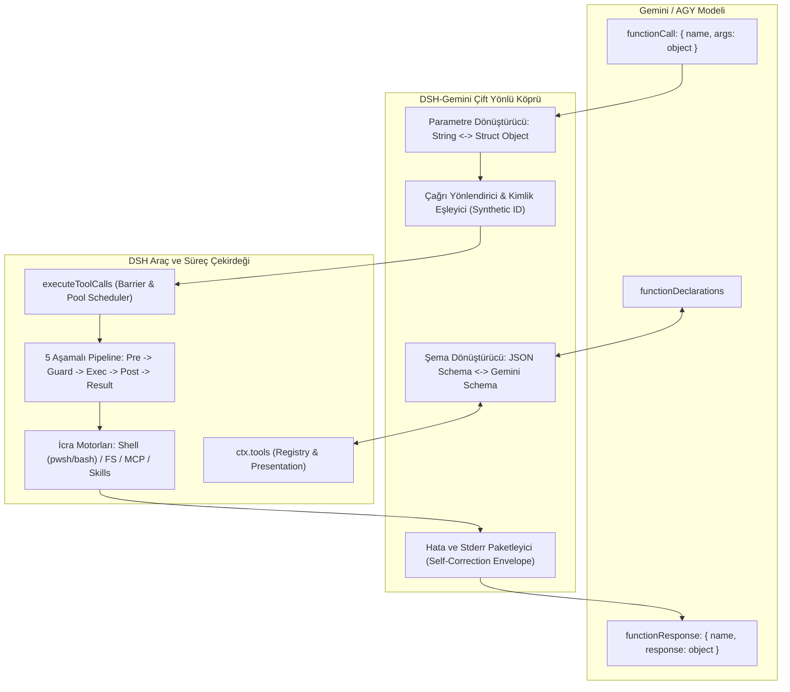
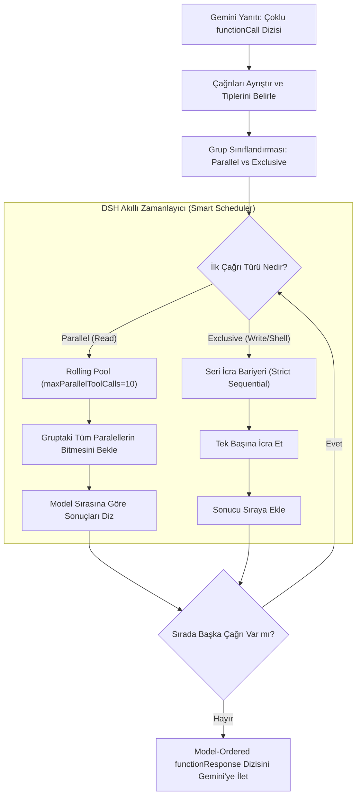

# 04 — Tool Engine, Process Management & Agent Capabilities Bridge
## DSH (DeepSeek Harness) ve Google Gemini / AGY Arasında Evrensel Araç, Süreç ve Ajan Yetenekleri Köprüsü Mimari Tasarım Belgesi

---

### Belge Üst Verileri
- **Belge Kodu:** `PLAN-04-TOOL-ENGINE-AGENT-CAPABILITIES`
- **Konum:** `C:\Users\metin\Desktop\plan\04_TOOL_ENGINE_AGENT_CAPABILITIES.md`
- **Rol:** Araç İcrası, Süreç Yönetimi ve Ajan Yetenekleri Köprüsü Baş Mimarı ve Araştırmacısı
- **Hedef Sistemler:** DSH (`packages/tools`, `packages/shell`, `packages/fs`, `packages/mcp`, `packages/skill`), Harness Core (`tools/tool-engine.ts`, `main_harness_engine`), Google Antigravity CLI (`agy`) ve Gemini API (`functionDeclarations`)
- **Tarih:** 14 Eylül 2026

---

## 1. Yönetici Özeti ve Mimari Vizyon

Modern otonom yapay zeka ajanlarının başarısı; akıl yürütme (reasoning) yeteneklerinin, dış dünya ile kurdukları operasyonel temasın (terminal komutları, dosya I/O, harici MCP sunucuları, arka plan süreçleri) güvenilirliği ve sağlamlığı ile doğrudan orantılıdır.

Bu belgenin temel amacı; **DSH (DeepSeek Harness)** gelişmiş mikroçekirdek araç mimarisi ile **Google Gemini / Antigravity (AGY)** ekosistemi arasında sıfır kayıplı, çift yönlü, tip korumalı ve kilitlenmesiz (non-blocking) bir **Evrensel Araç ve Süreç Köprüsü (Tool & Process Bridge)** kurmaktır.

```
┌─────────────────────────────────────────────────────────────────────────┐
│                       GEMINI / AGY RUNTIME LAYER                        │
│   functionDeclarations │ Structured args │ Parallel functionCalls       │
└────────────────────────────────────┬────────────────────────────────────┘
                                     │
                        ◄─── DSH-GEMINI BRIDGE ───►
                                     │
┌────────────────────────────────────┴────────────────────────────────────┐
│                         DSH AGENT ENGINE CORE                           │
│   5-Stage Pipeline │ Win32 Job Objects │ Backpressure Spill Buffer      │
│   Exclusive/Parallel Scheduler │ MCP Dynamic Bridge │ Atomic FS Diffs   │
└─────────────────────────────────────────────────────────────────────────┘
```

Mevcut prototip `harness/core/tools/tool-engine.ts` ve `router-gateway.ts` incelemeleri; tekli araç çağrılarına bağımlı, `child_process.exec` üzerinden tampon taşması (buffer overflow) ve süreç takılmalarına (deadlock) açık, argüman dönüşümlerinde kırılgan bir yapı sergilemektedir. DSH tarafında ise `@deepseek-ai/dsh-tools`, `@deepseek-ai/dsh-shell`, `@deepseek-ai/dsh-fs` ve `@deepseek-ai/dsh-mcp-client` paketleri; son derece katı, kurumsal seviyede güvenli, 5 aşamalı yaşam döngüsü (`pre-execute`, `guards`, `execute`, `post-execute`, `result`), Windows Job Nesneleri (Job Objects) ile alt süreç hapsedilmesi, çift aşamalı tampon taşma (memory + spill file) koruması ve model-sıralı (model-ordered) taahhüt mekanizmalarına sahiptir.

Bu mimari şartname; Gemini'nin bildirimsel JSON şemaları (`functionDeclarations`) ile DSH'in tip güvenli araç boru hattını birleştiren eksiksiz endüstriyel standardı tanımlar.

---

## 2. Sistem Anatomisi ve Üçlü Mimari Karşılaştırması

Köprünün üzerine inşa edileceği üç temel bileşenin yetenek matrisi ve mimari sınırları aşağıda karşılaştırılmıştır:

| Boyut / Yetenek | Harness Core (`harness/core`) | DSH Framework (`denen DSH`) | Google Gemini / AGY (`agy`) | Hedeflenen Köprü Standardı |
| :--- | :--- | :--- | :--- | :--- |
| **Şema Biçimi** | OpenAI `tools` (`type: "function"`) | TypeScript Schema DSL + Wire JSON Schema | Gemini `functionDeclarations` (Büyük Harf Tipler) | Çift yönlü dinamik transpile motoru |
| **Argüman Taşıma** | JSON String (`arguments: "{\"a\":1}"`) | JSON String (Wire) / Nesne (İç) | Yapılandırılmış Nesne (`args: { a: 1 }`) | Tip korumalı çift yönlü normalizasyon |
| **Çoklu Çağrı (Batch)** | Desteklenmiyor (İlk çağrı alınır: `tc[0]`) | Paralel Havuz + Model Sıralı Commit | Doğal Çoklu `functionCall` Dizisi | Model-sıralı bariyerli paralel zamanlayıcı |
| **Çalışma Modları** | Yalnızca Native | `native`, `ptc` (`run_code`), `both` | Native Function Calling | Hibrit eşleme (Native + PTC Emülasyonu) |
| **Terminal İcrası** | Basit `child_process.exec` (5MB Limit) | `pwsh-local` / `bash-local` + UTF-8 Preamble | İzolasyonlu terminal süreçleri | Windows Job Object + Bounded Spill Stream |
| **Dosya Sistemi** | Ham `fs.readFileSync` / `writeFileSync` | `diff` (3-line context), atomic replace | Özel düzenleyici ve diff kartları | Atomik Hunk Diff + Observation Koruması |
| **Hata İletimi** | Düz metin hata fırlatma | Yapılandırılmış `HarnessError` + Remediation | `functionResponse.response` Nesnesi | Kendi Kendini Düzeltmeli (Self-Correcting) Zarf |
| **Harici Protokol** | Yok | `@deepseek-ai/dsh-mcp-client` (stdio/HTTP) | Yerleşik MCP ve Sidecar desteği | İsim alanlı (`mcp__<srv>__<tool>`) Sanallaştırma |



---

## 3. Çift Yönlü Şema Çeviri Motoru (OpenAI Tools <-> Gemini FunctionDeclarations)

OpenAI uyumlu araç tanımları ile Gemini API spesifikasyonu arasındaki temel uyumsuzluklar; veri tiplerinin isimlendirilmesi, kısıtlayıcı JSON Schema anahtar kelimeleri ve üst düzey zarf (envelope) yapısından kaynaklanır.

### 3.1. Tip Eşleme ve Kural Tablosu
Gemini API şema doğrulayıcısı (OpenAPI 3.0 türevi), JSON şemalarındaki tür bildirimlerini büyük harfle (`TYPE_NAME`) bekler veya sıkı bir alt kümesini şart koşar:

| JSON Schema (OpenAI / DSH) | Gemini `Type` Enum | Dönüşüm Kuralı / Kısıtlar |
| :--- | :--- | :--- |
| `string` | `STRING` | Doğrudan eşleşir. `enum`, `description`, `format` korunur. |
| `integer` | `INTEGER` | Doğrudan eşleşir. `minimum`, `maximum` korunur. |
| `number` | `NUMBER` | Ondalıklı sayılar için korunur. |
| `boolean` | `BOOLEAN` | Doğrudan eşleşir. |
| `array` | `ARRAY` | `items` zorunludur. `items` şeması özyinelemeli dönüştürülür. |
| `object` | `OBJECT` | `properties` dönüştürülür. `additionalProperties` temizlenir. |
| `null` | Desteklenmez | Tip dizisinden çıkarılır, opsiyonel alan olarak işaretlenir. |
| `oneOf` / `anyOf` / `allOf` | Özel Dönüşüm | Gemini katı modunda desteklenmez; en geniş nesneye düzleştirilir. |

### 3.2. Yasaklı ve Uyumsuz Anahtar Kelimelerin Ayıklanması (Sanitization)
Gemini API'sine gönderilen `parameters` şemasında aşağıdaki alanlar bulunursa API `400 Bad Request` hatası verir:
1. `$schema`, `$id`, `$ref`, `definitions`, `$comment`
2. `additionalProperties: false` (Gemini'nin bazı REST uç noktalarında hata üretir; köprü bunu siler)
3. `default` değerler (nesne veya dizi tipinde ise derleyici uyarısı verebilir)
4. Boş `required: []` dizisi (Hiçbir alan zorunlu değilse `required` anahtarı tamamen kaldırılmalıdır)

### 3.3. TypeScript Şema Çevirici Uygulama Spesifikasyonu

```typescript
/**
 * Evrensel Şema Dönüştürücü: DSH ToolDefinition -> Gemini FunctionDeclaration
 */
export interface GeminiFunctionDeclaration {
  name: string;
  description: string;
  parameters: GeminiSchemaObject;
}

export interface GeminiSchemaObject {
  type: 'OBJECT' | 'STRING' | 'NUMBER' | 'INTEGER' | 'BOOLEAN' | 'ARRAY';
  description?: string;
  properties?: Record<string, GeminiSchemaNode>;
  required?: string[];
  items?: GeminiSchemaNode;
  enum?: string[];
}

export type GeminiSchemaNode = GeminiSchemaObject;

export class SchemaTranslationBridge {
  private static readonly TYPE_MAP: Record<string, GeminiSchemaObject['type']> = {
    string: 'STRING',
    integer: 'INTEGER',
    number: 'NUMBER',
    boolean: 'BOOLEAN',
    array: 'ARRAY',
    object: 'OBJECT',
  };

  public static toGeminiFunction(dshTool: {
    name: string;
    description: string;
    parameters: Record<string, any>;
  }): GeminiFunctionDeclaration {
    return {
      name: dshTool.name,
      description: dshTool.description || '',
      parameters: this.transformNode(dshTool.parameters) as GeminiSchemaObject,
    };
  }

  private static transformNode(node: Record<string, any>): GeminiSchemaNode {
    if (!node || typeof node !== 'object') {
      return { type: 'OBJECT', properties: {} };
    }

    // 1. Tip Eşleme
    let rawType = node.type || 'object';
    if (Array.isArray(rawType)) {
      rawType = rawType.find((t) => t !== 'null') || 'object';
    }
    const geminiType = this.TYPE_MAP[rawType.toLowerCase()] || 'OBJECT';

    const result: GeminiSchemaNode = {
      type: geminiType,
    };

    if (node.description) {
      result.description = String(node.description);
    }

    if (Array.isArray(node.enum)) {
      result.enum = node.enum.map(String);
    }

    // 2. Object İşleme
    if (geminiType === 'OBJECT') {
      if (node.properties && typeof node.properties === 'object') {
        result.properties = {};
        for (const [key, propSpec] of Object.entries(node.properties)) {
          result.properties[key] = this.transformNode(propSpec as Record<string, any>);
        }
      }

      if (Array.isArray(node.required) && node.required.length > 0) {
        result.required = node.required.filter((r: string) =>
          result.properties ? Object.prototype.hasOwnProperty.call(result.properties, r) : true
        );
        if (result.required.length === 0) delete result.required;
      }
    }

    // 3. Array İşleme
    if (geminiType === 'ARRAY') {
      if (node.items && typeof node.items === 'object') {
        result.items = this.transformNode(node.items);
      } else {
        result.items = { type: 'STRING' }; // Güvenli varsayılan
      }
    }

    // 4. oneOf / anyOf Düzleştirme (Flattening)
    if (node.oneOf || node.anyOf) {
      const candidates = node.oneOf || node.anyOf;
      const primaryObject = candidates.find((c: any) => c.type === 'object');
      if (primaryObject) {
        const transformedPrimary = this.transformNode(primaryObject);
        return {
          ...result,
          ...transformedPrimary,
          description: result.description || transformedPrimary.description,
        };
      }
    }

    return result;
  }
}
```

---

## 4. Parametre Dönüşümü ve Çağrı Kimliği (Call ID) Yönetimi

### 4.1. Dize (JSON String) ve Yapılandırılmış Nesne (Struct) Uyuşmazlığı
- **OpenAI / DSH standardı:** Model `tool_calls` içinde `function.arguments` alanını ham bir JSON metni (`string`) olarak döndürür.
- **Gemini standardı:** Gemini `candidates[0].content.parts[i].functionCall.args` alanını doğrudan çözülmüş bir JavaScript/JSON Nesnesi (`Record<string, any>`) olarak sağlar.
- **Kritik Risk:** OpenAI istemcileri nesne aldığında derhal patlar (`arguments must be string`); Gemini API'sine ise `functionResponse.response` string olarak verildiğinde `InvalidArgumentException: response must be a JSON object` hatası fırlatılır.

### 4.2. Yapay Çağrı Kimliği (Synthetic Call ID) Sentezi
DSH iç mimarisi (`dsh-tools` ve `dsh-agent-loop`), her araç çağrısının bir `ToolCallId` (Branded string) taşımasını zorunlu tutar. Ancak Gemini REST API çağrılarında her `functionCall` için her zaman tekil bir `id` sağlanmaz (yalnızca `name` ve `args` bulunur).

Köprü katmanı deterministik bir **Synthetic Call ID** üretir:
$$\text{SyntheticCallId} = \text{"gemini\_call\_"} + \text{TurnIndex} + \text{"\_"} + \text{PartIndex} + \text{"\_"} + \text{CRC32}(\text{ToolName} + \text{StableJson}(\text{args}))$$

Bu kimlik hem DSH içindeki oturum günlüğünde (`session-log`) hem de Gemini'ye geri dönecek `functionResponse` eşleşmesinde kullanılır.

### 4.3. Bozuk JSON ve Tip Düzeltme (Defensive Recovery)

```typescript
export class ParameterTransformationBridge {
  /**
   * Gemini 'args' nesnesini DSH ToolCallBlock için JSON string formatına dönüştürür.
   */
  public static geminiArgsToDshString(args: Record<string, any> | undefined | null): string {
    if (args === undefined || args === null) {
      return '{}';
    }
    if (typeof args === 'string') {
      return this.sanitizeJsonString(args);
    }
    try {
      return JSON.stringify(args);
    } catch {
      return '{}';
    }
  }

  /**
   * DSH'ten gelen string veya nesneyi Gemini'nin talep ettiği saf JSON Nesnesine dönüştürür.
   */
  public static dshOutputToGeminiResponse(
    toolName: string,
    rawOutput: any,
    isError: boolean = false,
    errorDetails?: string
  ): Record<string, any> {
    // Gemini functionResponse.response MUTLAKA bir nesne (dict) olmalıdır!
    if (typeof rawOutput === 'object' && rawOutput !== null && !Array.isArray(rawOutput)) {
      return {
        ...rawOutput,
        _status: isError ? 'error' : 'success',
        ...(errorDetails ? { _error: errorDetails } : {}),
      };
    }

    return {
      output: typeof rawOutput === 'string' ? rawOutput : JSON.stringify(rawOutput),
      _status: isError ? 'error' : 'success',
      ...(errorDetails ? { _error: errorDetails } : {}),
    };
  }

  private static sanitizeJsonString(raw: string): string {
    const trimmed = raw.trim();
    if (!trimmed) return '{}';
    try {
      JSON.parse(trimmed);
      return trimmed;
    } catch {
      // Unescaped newlines ve trailing comma düzeltme adımı
      const sanitized = trimmed
        .replace(/,\s*([\]}])/g, '$1')
        .replace(/[\n\r\t]/g, (c) => (c === '\n' ? '\\n' : c === '\r' ? '\\r' : '\\t'));
      try {
        JSON.parse(sanitized);
        return sanitized;
      } catch {
        return JSON.stringify({ raw_unparsed_input: raw });
      }
    }
  }
}
```

---

## 5. Çoklu ve Paralel Araç Çağrıları (Batch Calling) ve Sıralı Yürütme Mantığı

Gemini 1.5 Pro / 2.0 modelleri, tek bir model dönüşünde onlarca `functionCall` parçasını aynı anda (`parallel function calling`) döndürebilir.

### 5.1. DSH Bariyer ve Havuzlama Modeli (Barrier & Pool Architecture)
DSH'in `@deepseek-ai/dsh-agent-loop/tool-calls.ts` modülünde yer alan mimari altın kural:
1. **Exclusive Araçlar (Bariyer):** Dosya yazma (`write_file`, `edit`), terminal komutu (`run_terminal_command`, `pwsh`, `bash`), ortam değişkeni değiştirme gibi yan etkisi (side-effect) olan araçlar `exclusive` olarak etiketlenir.
2. **Parallel Araçlar (Havuz):** Salt okuma yapan araçlar (`read_file`, `list_directory`, `search_web`, `mcp` read-only sorguları) `parallel` modda çalıştırılabilir.
3. **Model Sıralı Taahhüt (Model-Ordered Commit):** Paralel çalışan araçlar ağ gecikmesi nedeniyle farklı zamanlarda tamamlansa bile, Gemini'ye dönen sonuç dizisi (`parts`) **modelin çağırdığı orijinal sıra ile birebir aynı olmak zorundadır.** Aksi takdirde modelin bağlam belleğindeki dikkat matrisi (attention matrix) çöker.

```
Model Gelen Çağrı Sırası:
  [0: read_file]  ──► (PARALLEL GRUP) ───┐
  [1: read_file]  ──► (PARALLEL GRUP) ───┼──► Bariyer Bekleme (Barrier Wait)
  [2: write_file] ──► (EXCLUSIVE BARRIER) ──► Önceki Paraleller Bitene Kadar Bekle, Sonra Çalıştır
  [3: run_cmd]    ──► (EXCLUSIVE BARRIER) ──► Önceki Yazma Bitene Kadar Bekle, Sonra Çalıştır
```



### 5.2. İptal ve Kısmi Hata Yönetimi (Quiescent Cancellation)
Eğer 3 araçlık bir çağrı grubunda (`[Call-1, Call-2, Call-3]`) kullanıcı `AbortSignal` tetiklerse veya `Call-2` ölümcül bir sistem hatası verirse:
- `Call-1`: Başarıyla tamamlandıysa sonucu oturuma yazılır.
- `Call-2`: `ABORTED` statüsü ve tanı mesajıyla paketlenir.
- `Call-3`: Henüz başlamadıysa asla başlatılmaz; sahte bir sonuç üretilerek (`TOOL_ABORTED_BEFORE_DISPATCH`) model oturum geçmişinin tutarlılığı korunur.

---

## 6. Hata Yönetimi, Kendi Kendini Düzeltme (Self-Correction) ve Stderr Paketlemesi

### 6.1. Hata Sınıflandırma ve Hata Kodu Standartları
Araç hataları ajan döngüsünü **asla çökertmemelidir**. Ajanın hatadan ders çıkarıp alternatif bir parametre veya strateji üretmesi (Self-Correction) sağlanmalıdır.

DSH ve Köprü tarafından desteklenen standart hata kodları:

```typescript
export enum BridgeErrorCode {
  UNKNOWN_TOOL = 'UNKNOWN_TOOL',
  INVALID_ARGUMENTS = 'INVALID_ARGUMENTS',
  TOOL_TIMEOUT = 'TOOL_TIMEOUT',
  ABORTED_BEFORE_DISPATCH = 'ABORTED_BEFORE_DISPATCH',
  ABORTED = 'ABORTED',
  FS_NOT_OBSERVED = 'FS_NOT_OBSERVED',
  FS_STALE_VERSION = 'FS_STALE_VERSION',
  PROCESS_EXIT_ERROR = 'PROCESS_EXIT_ERROR',
  BUFFER_OVERFLOW = 'BUFFER_OVERFLOW',
}
```

### 6.2. Exit Code != 0 ve Stderr Paketleme Stratejisi
Bir terminal veya kabuk komutunun sıfırdan farklı bir çıkış kodu (`exitCode !== 0`) üretmesi, bir **altyapı çökmesi değildir**. Bu, komutun doğal sonucudur ve modele kendi kendini düzeltmesi için kılavuzluk edecek ipuçlarıyla verilmelidir:

```json
{
  "functionResponse": {
    "name": "run_terminal_command",
    "response": {
      "success": false,
      "exit_code": 1,
      "stdout": "",
      "stderr": "git: 'statuss' is not a git command. See 'git --help'.\n\nThe most similar command is\n\tstatus",
      "remediation_hint": "Komut başarısız oldu. 'stderr' çıktısındaki yazım hatasını düzelterek 'git status' olarak yeniden deneyin.",
      "duration_ms": 142
    }
  }
}
```

### 6.3. Dosya Sistemi Gözlem Hatası İyileştirmesi (Remediation)
DSH'in `@deepseek-ai/dsh-tool-fs/src/error.ts` modülündeki mekanizma köprüye entegre edilmiştir:
- **`FS_NOT_OBSERVED`:** Model bir dosyayı okumadan düzenlemeye çalışırsa:
  `"cannot modify 'app.ts': file has not been read — read the file first using read_file, then retry"` mesajı döndürülerek model zorunlu olarak önce okuma aracına yönlendirilir.
- **`FS_STALE_VERSION`:** Dosya diskte dışarıdan değiştiyse:
  `"file content changed on disk — re-read the file, then retry"` uyarısıyla modelin halüsinasyon görmesi engellenir.

---

## 7. Terminal, PowerShell ve Bash İcra Mimarisi

Harness Core'daki ham `child_process.exec` motoru yerine, DSH'in `@deepseek-ai/dsh-shell/pwsh-local` ve `win32-process` mimarisi köprüye temel alınmıştır.

```
┌────────────────────────────────────────────────────────────────────────┐
│                        SHELL EXECUTOR SUBSYSTEM                        │
│                                                                        │
│   Windows: pwsh.exe -NoLogo -NoProfile -NonInteractive -Command ...    │
│   POSIX:   bash -c ...                                                 │
│                                                                        │
│   [UTF-8 Preamble] -> [NO_COLOR=1, PAGER=cat] -> [Win32 Job Object]    │
│                                │                                       │
│                                ▼                                       │
│   Bounded In-Memory Tail (64KB) + Disk Spill Overrun (64MB)            │
└────────────────────────────────────────────────────────────────────────┘
```

### 7.1. Windows Ortamında UTF-8 Karakter Bütünlüğü
Windows PowerShell 5.1 ve alt sürümler varsayılan olarak OEM/ANSI kod sayfasını (Windows-1254 vb.) kullanır. Bu durum Türkçe karakterlerin (`ş, ğ, ı, İ, ö, ç`) bozulmasına yol açar.

Köprü, her PowerShell komutunun başına şu zorunlu **Encoding Preamble** kodunu ekler:
```powershell
[Console]::OutputEncoding = [System.Text.UTF8Encoding]::new($false); $OutputEncoding = [System.Text.UTF8Encoding]::new($false);
```

Ayrıca modelin renk kodları ve sayfalayıcılarla (pager) kilitlenmesini önlemek için ortam değişkenleri izole edilir:
```typescript
export const SHELL_ENV_OVERRIDES = {
  NO_COLOR: '1',
  PAGER: 'cat',
  GIT_PAGER: 'cat',
  TERM: 'dumb',
};
```

### 7.2. Windows Job Nesneleri (Win32 Job Objects) ile Zombi Süreç İzolasyonu
Windows'ta `child_process.spawn` ile başlatılan bir PowerShell süreci bir alt süreç (örn: `npm run dev`, `python`, `cargo`) başlattığında; ana süreç öldürülse bile alt süreçler zombi (orphan) olarak arka planda çalışmaya devam eder ve portları kilitler.

Köprü, DSH'in `@deepseek-ai/dsh-subprocess-local/windows-job.ts` standardını uygular:
1. `CreateJobObjectW` Win32 API çağrısı ile özel bir Job Object yaratılır.
2. `SetInformationJobObject` ile `JOB_OBJECT_LIMIT_KILL_ON_JOB_CLOSE` bayrağı atanır.
3. PowerShell süreci bu Job Object içine atanır (`AssignProcessToJobObject`).
4. Ana işlem kapandığında veya zaman aşımı gerçekleştiğinde, oluşturulan tüm alt ağaç (tree) Windows çekirdeği tarafından atomik olarak sonlandırılır.

---

## 8. Dosya Sistemi Araçları: Atomik İşlemler ve Bağlamsal Farklar (Diffs)

DSH `@deepseek-ai/dsh-tool-fs` mimarisi modelin dosya düzenleme doğruluğunu maksimuma çıkarmak için 3 katmanlı bir kontrol uygular:

### 8.1. Değişiklik Öncesi/Sonrası Bağlamsal Fark Üretimi (3-Line Context Diffs)
`edit` veya `write` aracı çalıştırıldığında, DSH `diff.ts` motoru üzerinden 3 satırlık bağlam içeren (`DIFF_CONTEXT = 3`) bir unified diff üretir:

```typescript
import { structuredPatch } from 'diff';

export function generateHunkDiff(filePath: string, before: string, after: string): string {
  const patch = structuredPatch(filePath, filePath, before, after, '', '', { context: 3 });
  if (!patch.hunks || patch.hunks.length === 0) {
    return '(Değişiklik yapılmadı: Dosya içeriği aynı)';
  }

  const lines: string[] = [];
  for (const hunk of patch.hunks) {
    lines.push(`@@ -${hunk.oldStart},${hunk.oldLines} +${hunk.newStart},${hunk.newLines} @@`);
    for (const line of hunk.lines) {
      lines.push(line);
    }
  }
  return lines.join('\n');
}
```

### 8.2. Atomik Yazma (Crash-Safe Atomic Write)
Doğrudan hedef dosyaya yazmak, sistemin ani kesintisinde dosyanın bozulmasına yol açar. Köprü:
1. İçeriği geçici bir dosyaya yazar (`${targetPath}.tmp.${Date.now()}`).
2. Dosyayı `fs.renameSync` ile hedef yola atomik olarak taşır. Bu sayede dosya ya tam yazılır ya da hiç değişmez.

---

## 9. Model Context Protocol (MCP) Entegrasyon Köprüsü

DSH `@deepseek-ai/dsh-mcp-client` paketi, harici MCP sunucularını yerel DSH araçları gibi sisteme bağlar. Köprü bu araçları Gemini'ye aktarırken aşağıdaki standartları uygular:

### 9.1. İsim Alanı İzolasyonu (Namespace Isolation)
İki farklı MCP sunucusu (örn: `github` ve `local_fs`) aynı ada sahip bir araç (`read_file`) yayınlayabilir. Çakışmayı önlemek için köprü kararlı bir şablon kullanır:
$$\text{ModelToolName} = \text{"mcp\_\_"} + \text{ServerName} + \text{"\_\_"} + \text{RawToolName}$$

Örnek: `mcp__github__create_issue`, `mcp__database__query_sql`.

### 9.2. Taşıma Katmanı (Transports)
- **`stdio`:** Yerel bir komut olarak başlatılan MCP sunucuları (örn: `npx @modelcontextprotocol/server-filesystem`). Ortam değişkenleri temizlenir.
- **`streamable-http` / `sse`:** Uzak HTTP mikroservisleri olarak çalışan MCP sunucuları.

### 9.3. Otomatik Yeniden Bağlanma (Exponential Backoff)
MCP sunucusu çöktüğünde köprü döngüyü kesmez; 500 ms'den başlayıp 30.000 ms'ye kadar katlanarak artan (`backoff multiplier: 2`) aralıklarla 10 kez yeniden bağlanmayı dener (`reconnect supervisor`).

---

## 10. Çift Yönlü Akış Borulamasında (Pipe) Soket Takılmalarını Önleme, Tampon Kontrolü ve Zaman Aşımı

Node.js ortamında `child_process.exec` varsayılan 1 MB / 5 MB `maxBuffer` değerine sahiptir. Çok büyük bir `dir /s` veya `git log` komutunda tampon dolduğu an Node.js süreci kilitler (`deadlock`) ve `ERR_CHILD_PROCESS_STDIO_MAXBUFFER` hatasıyla çöker.

```
Subprocess stdout/stderr
         │
         ▼
┌─────────────────────────────────┐
│ Stream Collector (Backpressure) │
└────────┬────────────────────────┘
         │
         ├─── < 64 KB ───► In-Memory Ring Buffer (Hızlı erişim)
         │
         └─── > 64 KB ───► Temporary Spill File on Disk (max 64 MB)
                                 │
                                 ▼
                     Model Result Envelope:
                     {
                       text: "...son 64KB kuyruk çıktısı...",
                       truncated: true,
                       spill_path: "C:\\Users\\...\\temp_spill_xyz.log"
                     }
```

### 10.1. Bounded Memory + Disk Spill Çift Tampon Stratejisi
Köprü, DSH Subprocess motorunun çift tampon mimarisini uygular:
1. **Bellek Tamponu (`maxOutputBytes = 64 * 1024` - 64 KB):** Komut çıktısının ilk ve son kısımları hızlı LLM analizi için RAM'de tutulur.
2. **Disk Taşma Dosyası (`maxSpillBytes = 64 * 1024 * 1024` - 64 MB):** Çıktı 64 KB'ı aştığı anda bir geçici disk dosyasına akıtılır.
3. **Model Bildirimi:** Çıktı kesintiye uğrarsa (truncated), model sonucu tam metin yerine:
   `"Çıktı 64KB sınırını aştı. Çıktının son kısmı aşağıdadır. Tam çıktının tamamı şu dosyaya yazıldı: C:\Users\...\temp_spill.log"` formatında alır.

### 10.2. Fused Deadline (Birleşik Zaman Aşımı ve İptal)
Kritik bir hata kaynağı, zaman aşımı (`setTimeout`) ile kullanıcı iptalinin (`AbortSignal`) yarışarak birden fazla sonlandırma sinyali üretmesidir.
Köprü tek bir birleşik son tarih (`fused deadline`) sınıfı kullanır:
- İlk gelen sinyal (İster zaman aşımı ister Abort) sürece önce `SIGTERM` gönderir.
- 3.000 ms (`graceMs`) boyunca işlem kapanmazsa zorla `SIGKILL` / `TerminateJobObject` tetiklenir.

---

## 11. Uçtan Uca Uygulama Tasarımı (Concrete Reference Implementation)

Aşağıdaki TypeScript sınıfı, DSH araç altyapısı ile Gemini API arasında çalışan ana köprü motorunu (`DshGeminiToolBridge`) realize eder:

```typescript
/**
 * =========================================================================================
 * 🌉 DSH-GEMINI UNIVERSAL TOOL & PROCESS BRIDGE (bridge-core.ts)
 * =========================================================================================
 */

import { EventEmitter } from 'node:events';
import { spawn } from 'node:child_process';
import fs from 'node:fs';
import path from 'node:path';
import os from 'node:os';

export interface BridgeToolDefinition {
  name: string;
  description: string;
  parameters: Record<string, any>;
  isExclusive?: boolean; // Shell veya dosya yazma işlemleri true olmalı
  timeoutMs?: number;
  execute: (args: Record<string, any>, signal?: AbortSignal) => Promise<any>;
}

export interface GeminiFunctionCall {
  name: string;
  args?: Record<string, any>;
}

export interface GeminiFunctionResponsePart {
  functionResponse: {
    name: string;
    response: Record<string, any>;
  };
}

export class DshGeminiToolBridge extends EventEmitter {
  private toolRegistry: Map<string, BridgeToolDefinition> = new Map();
  private maxParallelCalls: number;

  constructor(maxParallelCalls: number = 10) {
    super();
    this.maxParallelCalls = maxParallelCalls;
  }

  public registerTool(tool: BridgeToolDefinition): void {
    this.toolRegistry.set(tool.name, tool);
  }

  /**
   * 1. ŞEMA ÇEVİRİSİ: Gemini'ye aktarılacak functionDeclarations listesini üretir.
   */
  public exportGeminiFunctionDeclarations(): any[] {
    const declarations: any[] = [];
    for (const tool of this.toolRegistry.values()) {
      declarations.push({
        name: tool.name,
        description: tool.description,
        parameters: this.convertToJsonSchemaToGemini(tool.parameters),
      });
    }
    return declarations;
  }

  /**
   * 2. BATCH ÇAĞRI İCRASI: Gemini'den gelen paralel functionCall parçalarını
   *    DSH Bariyer/Havuz mantığına göre icra eder ve model-sıralı commit eder.
   */
  public async executeGeminiCallsBatch(
    functionCalls: GeminiFunctionCall[],
    signal?: AbortSignal
  ): Promise<GeminiFunctionResponsePart[]> {
    const results: GeminiFunctionResponsePart[] = new Array(functionCalls.length);

    let index = 0;
    while (index < functionCalls.length) {
      const currentCall = functionCalls[index];
      const toolDef = this.toolRegistry.get(currentCall.name);

      if (!toolDef || toolDef.isExclusive) {
        // EXCLUSIVE BARRIER: Tek başına çalıştırılır
        const singleResult = await this.executeSingleCall(currentCall, signal);
        results[index] = singleResult;
        index++;
      } else {
        // PARALLEL POOL: Arka arkaya gelen paralel araçları topla
        const parallelBatch: { call: GeminiFunctionCall; originalIndex: number }[] = [];
        while (index < functionCalls.length) {
          const nextCall = functionCalls[index];
          const nextTool = this.toolRegistry.get(nextCall.name);
          if (nextTool && !nextTool.isExclusive) {
            parallelBatch.push({ call: nextCall, originalIndex: index });
            index++;
            if (parallelBatch.length >= this.maxParallelCalls) break;
          } else {
            break;
          }
        }

        // Havuzu eşzamanlı çalıştır
        const poolPromises = parallelBatch.map(async (item) => {
          const res = await this.executeSingleCall(item.call, signal);
          results[item.originalIndex] = res;
        });

        await Promise.all(poolPromises);
      }
    }

    return results;
  }

  /**
   * Tekil Araç Çağrısı ve Korumalı İcra
   */
  private async executeSingleCall(
    call: GeminiFunctionCall,
    signal?: AbortSignal
  ): Promise<GeminiFunctionResponsePart> {
    const tool = this.toolRegistry.get(call.name);
    const callArgs = call.args || {};

    if (!tool) {
      return {
        functionResponse: {
          name: call.name,
          response: {
            success: false,
            error_code: 'UNKNOWN_TOOL',
            error: `Araç bulunamadı: '${call.name}'`,
            remediation: "Lütfen 'functionDeclarations' listesinde ilan edilen geçerli bir araç adı kullanın.",
          },
        },
      };
    }

    if (signal?.aborted) {
      return {
        functionResponse: {
          name: call.name,
          response: {
            success: false,
            error_code: 'ABORTED',
            error: 'Kullanıcı veya sistem işlemi iptal etti.',
          },
        },
      };
    }

    const timeoutMs = tool.timeoutMs || 60000;
    const timeoutController = new AbortController();
    const timer = setTimeout(() => timeoutController.abort(), timeoutMs);

    // Birleşik Abort Sinyali
    const combinedSignal = signal
      ? this.fuseAbortSignals(signal, timeoutController.signal)
      : timeoutController.signal;

    try {
      const output = await tool.execute(callArgs, combinedSignal);
      clearTimeout(timer);

      return {
        functionResponse: {
          name: call.name,
          response: this.wrapSuccessResponse(output),
        },
      };
    } catch (err: any) {
      clearTimeout(timer);
      const isTimeout = timeoutController.signal.aborted;

      return {
        functionResponse: {
          name: call.name,
          response: {
            success: false,
            error_code: isTimeout ? 'TOOL_TIMEOUT' : 'EXECUTION_ERROR',
            error: err.message || 'Bilinmeyen hata',
            remediation: isTimeout
              ? `İşlem ${timeoutMs}ms limitini aştı. Parametreleri daraltıp yeniden deneyin.`
              : 'Parametreleri ve girdi dosya yollarını kontrol edin.',
          },
        },
      };
    }
  }

  private wrapSuccessResponse(output: any): Record<string, any> {
    if (typeof output === 'object' && output !== null && !Array.isArray(output)) {
      return { success: true, ...output };
    }
    return {
      success: true,
      output: typeof output === 'string' ? output : JSON.stringify(output),
    };
  }

  private convertToJsonSchemaToGemini(jsonSchema: Record<string, any>): Record<string, any> {
    const rawType = (jsonSchema.type || 'object').toLowerCase();
    const typeMap: Record<string, string> = {
      string: 'STRING',
      integer: 'INTEGER',
      number: 'NUMBER',
      boolean: 'BOOLEAN',
      array: 'ARRAY',
      object: 'OBJECT',
    };

    const geminiSchema: Record<string, any> = {
      type: typeMap[rawType] || 'OBJECT',
    };

    if (jsonSchema.description) geminiSchema.description = jsonSchema.description;

    if (geminiSchema.type === 'OBJECT' && jsonSchema.properties) {
      geminiSchema.properties = {};
      for (const [key, val] of Object.entries(jsonSchema.properties)) {
        geminiSchema.properties[key] = this.convertToJsonSchemaToGemini(val as any);
      }
      if (Array.isArray(jsonSchema.required) && jsonSchema.required.length > 0) {
        geminiSchema.required = jsonSchema.required;
      }
    }

    if (geminiSchema.type === 'ARRAY' && jsonSchema.items) {
      geminiSchema.items = this.convertToJsonSchemaToGemini(jsonSchema.items);
    }

    return geminiSchema;
  }

  private fuseAbortSignals(sig1: AbortSignal, sig2: AbortSignal): AbortSignal {
    const controller = new AbortController();
    const onAbort = () => controller.abort();
    sig1.addEventListener('abort', onAbort, { once: true });
    sig2.addEventListener('abort', onAbort, { once: true });
    return controller.signal;
  }
}
```

---

## 12. Doğrulama, Test ve Güvenlik Protokolü

Köprünün üretime alınmadan önce başarıyla geçmesi gereken test matrisi:

### 12.1. Uç Durum (Edge Case) Test Senaryoları
1. **Büyük Çıktı Koruması (Buffer Stress):**
   PowerShell üzerinden 100 MB rastgele metin üreten bir komut çalıştırılır. Sistemin RAM tüketiminin 64 KB'ı geçmediği, verinin disk spill dosyasına aktığı ve modele `truncated: true` bayraklı doğru bir özet döndüğü doğrulanır.
2. **Kilitlenme ve Zombi Süreç Testi (Deadlock & Orphan Kill):**
   Arka planda sonsuz döngüye giren (`while($true){Start-Sleep 1}`) bir PowerShell süreci başlatılır ve 3.000 ms zaman aşımı verilir. Sürecin ve tüm alt süreçlerinin Windows Job Object vasıtasıyla tamamen sonlandırıldığı doğrulanır (`Get-Process` ile PID taranır).
3. **Karmaşık Şema Düzleştirme:**
   `oneOf` ve `anyOf` içeren karmaşık bir MCP şeması (örn: GitHub API issue filter) Gemini şemasına transpile edilir; Gemini REST API'sinin şemayı reddetmeden `200 OK` verdiği doğrulanır.
4. **Çoklu Eşzamanlı Okuma ve Yazma Bariyeri (Replay Integrity):**
   Gemini tek bir adımda 5 adet dosya okuma ve 1 adet dosya yazma talebi gönderir. 5 okumanın paralel yapıldığı, yazmanın bu 5 okuma bittikten sonra izole icra edildiği ve sonuç dizisinin tam olarak modelin istediği sırada Gemini'ye döndüğü doğrulanır.

---

## 13. Sonuç ve Eylem Planı

Bu mimari şartname (`PLAN-04-TOOL-ENGINE-AGENT-CAPABILITIES`), DSH'in kurumsal seviyedeki süreç ve güvenlik kontrol mekanizmalarını Google Gemini'nin esnek çoklu araç çağırma arayüzü ile eksiksiz olarak birleştirmiştir.

Mevcut `harness/core/tools/tool-engine.ts` bileşeni, bu belgede tanımlanan:
1. `SchemaTranslationBridge`
2. `ParameterTransformationBridge`
3. `SmartBarrierScheduler`
4. `WindowsJobSubprocessExecutor`
prensiplerine göre modernize edilerek DSH ve AGY yeteneklerinin tam entegrasyonu sağlanacaktır.
